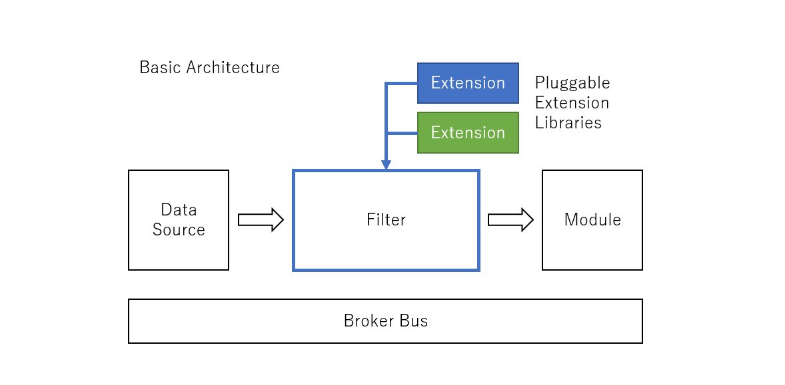

# FILTER module 
This module provide capability of data conversion, formatting and so on. 
You can add verious conversion logic by plugguable extension libraries. 
 
## Execution Sequence 
When FILTER is loaded and FILTER_Create function is called by Broker. FILTER loads extension library specified in JSON configuration file. You can specify more than one extension libraries. 
 
Each extension libarary can handle multiple context. After loaded extension libraries, FILTER calls create a context for each MAC address by calling LIB_CreateContext function. When you select design style that each extension library is designed and developed for each kind of sensor tag, each library shoud distinguish multiple tags of same kind sensor tag. Because FILTER manages each context from each extension library in association with the identity of each tag, data of each tag cna be correctly converted  within a certain flexilibity. 

## FILTER configuration 
You can speciy configuration as follows...
```json
    {
      "name": "BLE Filter",
      "loader": {
        "name" : "native",
        "entrypoint" : {
          "module.path": "build/modules/filter/libfilter.so"
        }
      },
      "args": [
          {
            "filter-name" :"TI CC2650 Resolver",
            "loader" :{
              "name":"native",
              "entrypoint":{
                "module.path": "build/samples/ble_filter_gateway/filters/ticc2650/libticc2650.so"
              }
            },
            "availables" : [
              {
                "sensor-tag":"<<Sensor Tag MAC ADDRESS - AA:BB:CC:DD:EE:FF>>",
                "sensor-types":[
                  {"sensor-type":"temperature"},
                  {"sensor-type":"humidity"},
                  {"sensor-type":"pressure"},
                  {"sensor-type":"movement"},
                  {"sensor-type":"brightness"}
                ]
              }
            ]
          }
        ]
    },
```
The 'avaliables' object is a configration for extension library. this json strings is passed to extention library at LIB_Create function calling so that you can add some specific configuration objects.  
※ This sample configuraiton is from [ble_filter_gateway](../../samples/ble_filter_gateway/README.md) sample.  
※ This configuration is for LINUX. In the case of Windows, please refer [filter_sample](../../samples/filter_sample/README.md) sample. 

## Extesion Library 
Extension Library should implement four functions. 
- RESOLVER_HANDLE LIB_Create(MODULE_HANDLE module, const char* resolverName) 
- RESOLVER_CONTEXT* LIB_CreateContext(RESOLVER_HANDLE handle, JSON_OBJECT* configuration) 
- CONSTBUFFER_HANDLE LIB_Resolve(RESOLVER_CONTEXT, const char* caracteristics, const char* timestamp, const CONSTBUFFER* message) 
- void LIB_Destroy(RESOLVER_HANDLE handle) 

Extension Library's C language header file template. 
```c
#ifndef EXT_LIB_H
#define EXT_LIB_H

#include "module.h"

#ifdef __cplusplus
extern "C"
{
#endif

// TODO: add some declaration

#ifdef __cplusplus
}
#endif

#endif /*EXT_LIB_H*/
```

Extension Library's C language source template. 
```c
#include <stdlib.h>
#include <stdint.h>
#include <stdio.h>
#include <math.h>

#ifdef _CRTDBG_MAP_ALLOC
#include <crtdbg.h>
#endif

#include "azure_c_shared_utility/gballoc.h"
#include "azure_c_shared_utility/xlogging.h"
#include "azure_c_shared_utility/constmap.h"
#include "azure_c_shared_utility/constbuffer.h"
#include "azure_c_shared_utility/base64.h"

#include "module.h"
#include "message.h"
#include "broker.h"
#include "extlib.h"
#include "messageproperties.h"
#include "filter_api.h"

#include <parson.h>


typedef struct EXT_LIB_CONTEXT_TAG
{
	RESOLVER_HANDLE resolverHandle;
    // TODO: add other necessary members
} EXT_LIB_CONTEXT;

typedef struct EXT_LIB_CONTEXT_LIST_TAG
{
    EXT_LIB_CONTEXT context;
    void* next;
} EXT_LIB_CONTEXT_LIST;

typedef struct EXT_LIB_DATA_TAG
{
    MODULE_HANDLE moduleHandle;
	const char* name;
    EXT_LIB_CONTEXT_LIST* contexts;
} EXT_LIB_DATA;

static STRING_HANDLE resolve_default(RESOLVER_DATA_CONTEXT* handle, const char* name, const CONSTBUFFER* buffer)
{
    (void)handle;
	(void)name;
	STRING_HANDLE result = STRING_construct("");
	char* tmpRawData = (char*)malloc(buffer->size);
	memcpy(tmpRawData, buffer->buffer, buffer->size);
	STRING_concat(result, tmpRawData);
	free(tmpRawData);
	return result;
}

RESOLVER_HANDLE EXT_LIB_Create(MODULE_HANDLE module, const char* resolverName)
{
	EXT_LIB_DATA* handle = (EXT_LIB_DATA*)malloc(sizeof(EXT_LIB_DATA));
	handle->moduleHandle = module;
	handle->contexts = NULL;
	handle->name = NULL;
	char* tempRN = (char*)malloc(strlen(resolverName) + 1);
	strcpy(tempRN, resolverName);
	handle->name = tempRN;

	return handle;
}

RESOLVER_CONTEXT* EXT_LIB_CreateContext(MODULE_HANDLE module , JSON_Object* configuration)
{
    EXT_LIB_DATA* handle = (EXT_LIB_DATA*)module;
    EXT_LIB_CONTEXT_LIST* element = (EXT_LIB_CONTEXT_LIST*)malloc(sizeof(EXT_LIB_CONTEXT_LIST));
	element->context.resolverHandle=handle;
	element->next = NULL;
    EXT_LIB_CONTEXT_LIST* contexts = handle->contexts;
    if (contexts == NULL)
    {
        handle->contexts = element;
    }
    else
    {
        while(contexts->next!=NULL)
        {
            contexts = (EXT_LIB_CONTEXT_LIST*)contexts->next;
        }
        contexts->next = element;
    }

    // TODO: parse JSON configuration and build context 
    return (RESOLVER_CONTEXT*)&element->context;
}

void EXT_LIB_Destroy(RESOLVER_HANDLE resolverHandle)
{
    EXT_LIB_DATA* handle = (EXT_LIB_DATA*)resolverHandle;

    EXT_LIB_CONTEXT_LIST* contexts = handle->contexts;
	while (contexts != NULL)
	{
		EXT_LIB_CONTEXT_LIST* next = contexts->next;
		free(contexts);
		contexts = next;
	}
	if (handle->name != NULL)
	{
		free((void*)handle->name);
	}
    // TODO: free whole memories during this library execution
}

CONSTBUFFER_HANDLE EXT_LIB_Resolve(RESOLVER_DATA_CONTEXT* context, const char* characteristics, const char* timestamp, const CONSTBUFFER* message)
{
	CONSTBUFFER_HANDLE buffer = NULL;
	EXT_LIB_CONTEXT* currentContext = (EXT_LIB_CONTEXT*)context;

    // TODO: processing and generate message.

	return buffer;
}


static const RESOLVER_API_1 Resolver_GetApi_Impl =
{
    {RESOLVER_API_VERSION_1},
    EXT_LIB_Create,
    EXT_LIB_CreateContext,
    EXT_LIB_Resolve,
    EXT_LIB_Destroy
};

RESOLVER_EXPORT const RESOLVER_API* Resolver_GetApi(RESOLVER_API_VERSION resolver_api_version)
{
    (void)resolver_api_version;
    return (const RESOLVER_API*)&Resolver_GetApi_Impl;
}
```
