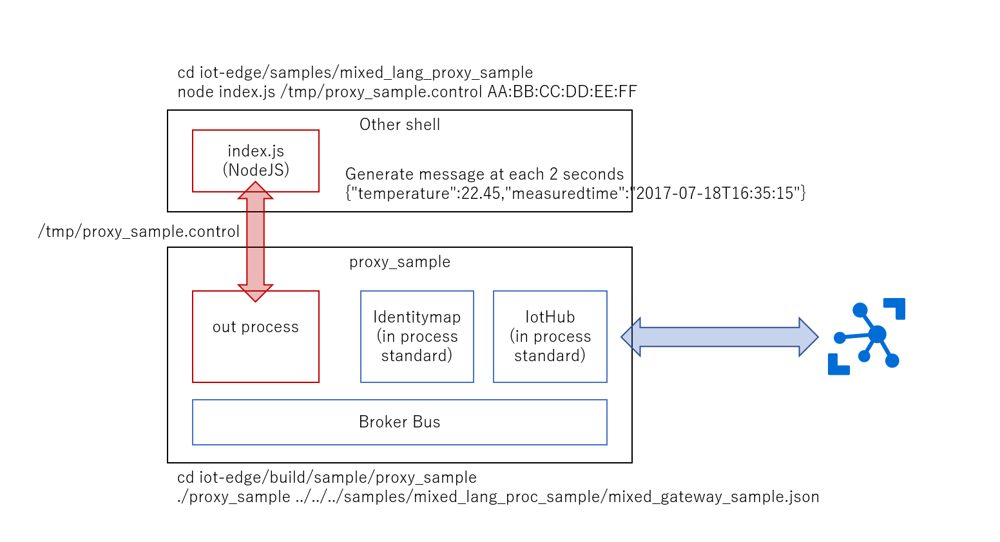

# IoT Edge Mixed Languages and Mixed IN/OUT Process Sample 
This sample is to show the way to execute multi language modules(C language and NodeJS) and in/out-process.
 

## Step by Step 
### Build - IoT Edge SDK
First, please update NodeJS to the latest version.  
After updated, clone [Azure IoT Edge SDK](http://github.com/Azure/iot-edge) for development environment.    
After that, build the SDK by the following steps. The working directory is just under 'iot-edge'.  

cd tools  
./build_nodejs.sh  
This step takes very long time and end of this step, shell script shows let you execute NODE_INCLUDE and NODE_LIB environment variables exporting.  

export NODE_INCLUDE=your_work_directry/dist/inc   
export NODE_LIB=your_work_directory/dist/lib  
※ Don't forget this step.  

./build.sh --enable-nodejs-binding --enable-nodejs-remote-modules  

After completed this shell execution,  

cd iot-edge/proxy/gateway/nodejs  
npm install  

By this step, install libraries of NodeJS gateway.
  

### Configuration    
Make IoT Hub on Azure and regist one device with appropriate deviceId, get SAS Token for it. Use them, update samples/mixed_lang_proc_sample/mixed_gateway_sample.json 
```json
{
    "modules": [{
            "name": "IoTHub",
            "loader": {
                "name": "native",
                "entrypoint": {
                    "module.path": "../../modules/iothub/libiothub.so"
                }
            },
            "args": {
                "IoTHubName": "<<Azure IoT Hub Name>>",
                "IoTHubSuffix": "<<Azure IoT Hub Suffix>>",
                "Transport": "mqtt"
            }
        },
        {
            "name": "mapping",
            "loader": {
                "name": "native",
                "entrypoint": {
                    "module.path": "../../modules/identitymap/libidentity_map.so"
                }
            },
            "args": [{
                "macAddress": "<< Local ID - AA:BB:CC:DD:EE:FF >>",
                "deviceId": "<<Azure IoT Hub Device ID>>",
                "deviceKey": "<<Azure IoT Hub Device Key>>"
            }]
        },
        {
            "name": "Sensor",
            "loader": {
                "name": "outprocess",
                "entrypoint": {
                    "activation.type": "none",
                    "control.id": "/tmp/proxy_sample.control",
                    "message.id": "/tmp/proxy_sample.message"
                }
            },
            "args": { "macAddress": "<< Local ID - AA:BB:CC:DD:EE:FF >>" }
        },
        {
            "name": "Logger",
            "loader": {
                "name": "native",
                "entrypoint": {
                    "module.path": "../../modules/logger/liblogger.so"
                }
            },
            "args": {
                "filename": "<</path/to/log-file.log>>"
            }
        }
    ],
    "links": [{
            "source": "*",
            "sink": "Logger"
        },
        {
            "source": "Sensor",
            "sink": "mapping"
        },
        {
            "source": "mapping",
            "sink": "IoTHub"
        },
        {
            "source": "IoTHub",
            "sink": "mapping"
        },
        {
            "source": "mapping",
            "sink": "Sensor"
        }
    ]
}
```  
The parts you should update are "<< ... >>" statements. 

### Execution  
Broker execution is to use application of proxy_sample.  
First you run main process which load and run IotHub and Identitymap modules.    
cd iot-edge/build/samples/proxy_sample  
./proxy_sample ../../../samples/mixued_lang_proc_sample/mixed_gateway_sample.json  
Then this process is wating for out process module loading and execution.  
  
Next using other shell, run following.  
cd iot-edge/samples/mixed_lang_proc_sample  
node index.js /tmp/proxy_sample.control AA:BB:CC:DD:EE:FF  
※AA:BB:CC:DD:EE:FF is part of device id. Update this part along with changing mixed_gateway_sample.json.  
